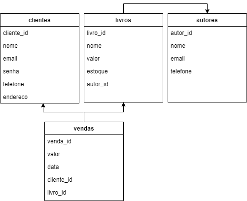
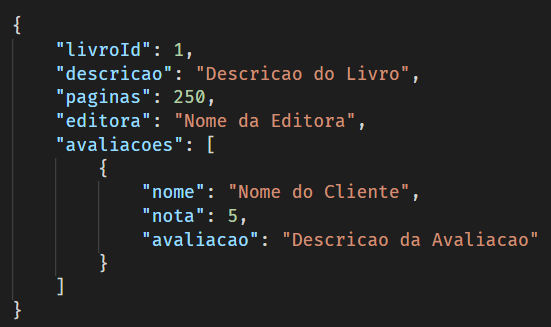

<h3 align="center">Bootcamp Desenvolvedor(a) Node.js - IGTI</h3>
<h2 align="center">Desafio Final</h2>

## Objetivos do Projeto

Exercitar os conceitos trabalhados no Curso para a criação de uma API em Node.js com Express, organizada em camadas, com autenticação, persistência em bancos de dados SQL, NoSQL e testes.

## Tecnologias

- [Node.js](https://nodejs.org/en/)
- [Express](https://www.npmjs.com/package/express)
- [Postgres](https://www.postgresql.org/)
- [MongoDB](https://www.mongodb.com/)
- [Jest](https://jestjs.io/pt-BR/)

## Enunciado

O desafio consiste em desenvolver uma API para controle de uma livraria on-line. A API deverá gerenciar os cadastros de livros, autores, clientes e vendas. Também deverá gerenciar as informações da página de venda de cada livro com suas informações e avaliações de leitores. Além disso, a API deverá ter controle de acesso aos endpoints, consultando o usuário que deseja fazer a requisição em uma tabela de usuários no banco de dados. Também será preciso desenvolver testes para a aplicação.

## Atividades

As descrições das atividades do desafio estão dividas nos tópicos abaixo.

### Criação do banco de dados relacional:

Os bancos de dados irão controlar o cadastro de clientes, livros, autores, vendas e usuários. Cada livro deve ter um autor associado. Cada venda precisa ter um cliente associado e um livro associado à aquela venda, com o respectivo valor do livro no momento da venda. A tabela de usuários serve para controlar o acesso a API. Na parte de autenticação e autorização, será explicado melhor os perfis existentes na aplicação e o que cada tipo de usuário pode acessar. O aluno deverá criar uma instância do PostgreSQL no ElephantSQL (ou outro servidor qualquer), e criar as tabelas de acordo com a modelagem abaixo:



Tabela: clientes

- cliente_id (SERIAL, não nulo) – chave primária da tabela. Identificador único do registro,
gerado automaticamente.
- nome (VARCHAR, não nulo) – nome do cliente.
- e-mail (VARCHAR, não nulo) – e-mail do cliente. Observação: será utilizado para
autenticar o cliente na API, juntamente com o campo de senha.
- senha (VARCHAR, não nulo) – senha do usuário.
- telefone (VARCHAR, não nulo) – telefone do cliente.
- endereco (VARCHAR, não nulo) – endereço do cliente.

Tabela: autores

- autor_id (SERIAL, não nulo) – chave primária da tabela. Identificador único do registro,
gerado automaticamente.
- nome (VARCHAR, não nulo) – nome do autor.
- e-mail (VARCHAR, não nulo) – e-mail do autor.
- telefone (VARCHAR, não nulo) – telefone do autor.

Tabela: livros

- livro_id (SERIAL, não nulo) – chave primária da tabela. Identificador único do registro,
gerado automaticamente.
- nome (STRING, não nulo) – nome do livro.
- valor (NUMERIC, não nulo) – valor do livro.
- estoque (INT, não nulo) – estoque do livro.
- autor_id (INT, não nulo) – chave estrangeira para a tabela de autores. Faz referência a
um autor.

Tabela: vendas
- venda_id (SERIAL, não nulo) – chave primária da tabela. Identificador único do registro,
gerado automaticamente.
- valor (NUMERIC, não nulo) – valor da venda (pega o valor do livro vendido no momento
da venda).
- data (DATE, não nulo) – data da venda.
- cliente_id (INT, não nulo) – chave estrangeira para a tabela de clientes. Faz referência a
um cliente.
- livro_id (INT, não nulo) – chave estrangeira para a tabela de livros. Faz referência a um
livro.

### Criação do banco de dados NoSQL:

O aluno deverá criar uma instância do MongoDB no MongoDB Atlas (ou outro servidor qualquer) e criar uma collection chamada “livroInfo”, que será a responsável por armazenar as informações que seriam exibidas em uma página de vendas do livro, bem como  uas avaliações recebidas. Em uma aplicação real, a estrutura de um documento desta coleção poderia variar de livro para livro, pois de acordo com sua categoria eles poderiam ter informações diferentes. Aqui no trabalho vamos considerar que todos têm a mesma estrutura, conforme a imagem abaixo:



A propriedade “livroId” serve para manter uma referência do id do livro do banco relacional. As propriedades “descricao”, “páginas” e “editora” dizem respeito ao livro em questão. A propriedade “avaliacoes" é uma lista de avaliações realizadas pelos clientes, possuindo o nome do cliente, a nota dada por ele e a descrição da sua avaliação.

### Desenvolvimento dos endpoints:

O aluno deverá criar um projeto chamado “livraria-api” em Node.js e utilizar o Express para a criação dos endpoints. O projeto deverá seguir a organização em camadas vista no curso. Para a integração com o banco de dados PostgreSQL, será opcional a utilização do
Sequelize. Da mesma forma, para a integração com o banco de dados MongoDB, a utilização do Mongoose também será opcional.

#### Endpoints do cliente:

1) Cadastrar um cliente:

- Método HTTP e URL: POST - http://localhost:3000/cliente
- Parâmetros: objeto JSON com o nome, e-mail, senha, telefone e endereço do
cliente.

2) Atualização de um cliente:

- Método HTTP e URL: PUT - http://localhost:3000/cliente
- Parâmetros: objeto JSON com o id do cliente que será atualizado, o nome, e-mail,
senha, telefone e endereço que serão atualizados.

3) Exclusão de um cliente (antes de excluir um cliente, verificar se existem vendas
cadastradas para ele. Caso exista, bloquear a exclusão)>
- Método HTTP e URL: DELETE - http://localhost:3000/cliente/{clienteId}
- Parâmetros: id do cliente passado diretamente na URL, exemplo de um id de valor
15 passado na URL: http://localhost:3000/cliente/15

4) Consultar os clientes cadastrados (retornar todos os clientes, com todas as informações
exceto o campo de senha, que não deve ser retornado neste endpoint)>
- Método HTTP e URL: GET - http://localhost:3000/cliente

5) Consultar um cliente em específico (pegar o id do cliente e retornar um objeto JSON com
suas informações, com todas as informações exceto o campo de senha, que não deve ser
retornado neste endpoint)>
- Método HTTP e URL: GET - http://localhost:3000/cliente/{clienteId}
- Parâmetros: id do cliente passado diretamente na URL, exemplo de um id de valor
15 passado na URL: http://localhost:3000/cliente/15

#### Endpoints do autor:

1) Cadastrar um autor:
- Método HTTP e URL: POST - http://localhost:3000/autor
- Parâmetros: objeto JSON com o nome, e-mail, telefone e do autor.

2) Atualização de um autor:
- Método HTTP e URL: PUT - http://localhost:3000/autor
- Parâmetros: objeto JSON com o id do autor que será atualizado, o nome, e-mail e
telefone que serão atualizados.

3) Exclusão de um autor (antes de excluir um autor, verificar se existem livros cadastrados
para ele. Caso exista, bloquear a exclusão):
- Método HTTP e URL: DELETE - http://localhost:3000/autor/{autorId}
- Parâmetros: id do autor passado diretamente na URL, exemplo de um id de valor
15 passado na URL: http://localhost:3000/autor/15

4) Consultar os autores cadastrados (retornar todos os autores):
- Método HTTP e URL: GET - http://localhost:3000/autor

5) Consultar um autor em específico (pegar o id do autor e retornar um objeto JSON com
suas informações):
- Método HTTP e URL: GET - http://localhost:3000/autor/{autorId}
- Parâmetros: id do autor passado diretamente na URL, exemplo de um id de valor 15
passado na URL: http://localhost:3000/autor/15

#### Endpoints do livro:

1) Cadastrar um livro:
- Método HTTP e URL: POST - http://localhost:3000/livro
- Parâmetros: objeto JSON com o nome, valor e id do autor, que são utilizados para
salvar o registro no PostgreSQL. Os demais registros que são inseridos na collection
“livroInfo” serão inseridos em outro endpoint.

2) Atualização de um livro:
- Método HTTP e URL: PUT - http://localhost:3000/livro

- Parâmetros: objeto JSON com o id do livro que será atualizado, o valor do livro que
será atualizado. O endpoint não deve permitir que o nome e autor do livro sejam alterados,
evitando assim possíveis inconsistências.

3) Exclusão de um livro (antes de excluir um livro, verificar se existem vendas realizadas
para ele. Caso exista, bloquear a exclusão):
- Método HTTP e URL: DELETE - http://localhost:3000/livro/{livroId}
- Parâmetros: id do livro passado diretamente na URL, exemplo de um id de valor 15
passado na URL: http://localhost:3000/livro/15

4) Consultar um livro em específico (pegar o id do livro e retornar um objeto JSON com
suas informações):
- Método HTTP e URL: GET - http://localhost:3000/livro/{livroId}
- Observações: retornar as informações do PostgreSQL e do MongoDB. Este
endpoint seria utilizado na aplicação web quando o usuário selecionasse um livro
em específico na listagem, sendo redirecionado para a página dele, com todas as
suas informações e avaliações.
- Parâmetros: id do livro passado diretamente na URL, exemplo de um id de valor 15
passado na URL: http://localhost:3000/livro/15

5) Consultar os livros cadastrados (retornar todos os livros):
- Método HTTP e URL: GET - http://localhost:3000/livro
- Observações: este endpoint e o próximo devem retornar somente os dados do
banco relacional, pois eles serão utilizados somente na listagem dos livros. Caso o
usuário queira detalhar mais informações a respeito de um livro em específico, estes
dados são obtidos no endpoint anterior.

6) Consultar os livros cadastrados de um autor em específico (pegar o id do autor na URL
e retornar uma lista de seus livros, sendo cada venda representado por um objeto JSON
com todas as propriedades)
- URL: http://localhost:3000/livro?autorId={autorId}

- Método HTTP: GET.
- Parâmetros: id do livro passado diretamente na URL, exemplo de um id de valor 15
passado na URL: http://localhost:3000/livro?autorId=15 (Sugestão: pode ser usada a
mesma estrutura do endpoint do item 5, que consulta todos os livros, só que aqui nesse
caso ele receberia um parâmetro para filtrar o autor).

7) Cadastrar informações do livro:
- Método HTTP e URL: POST – http://localhost:3000/livro/info
- Parâmetros: objeto JSON com o “livroId” do livro que terá as informações
cadastradas e as propriedades a serem salvas no MongoDB.

8) Atualizar informações do livro:
- Método HTTP e URL: PUT – http://localhost:3000/livro/info
- Parâmetros: objeto JSON com o “livroId” do livro que terá as informações
atualizadas, e as propriedades a serem salvas no MongoDB.

9) Excluir informações do livro:
- Método HTTP e URL: DELETE - http://localhost:3000/livro/info/{livroId}
- Parâmetros: id do livro passado diretamente na URL, exemplo de um id de valor 15
passado na URL: http://localhost:3000/livro/info/15.

10) Cadastrar uma avaliação:
- Método HTTP e URL: POST – http://localhost:3000/livro/{livroId}/avaliacao
- Parâmetros: objeto JSON com o nome do cliente que está realizando a avaliação,
a nota e a descrição da avaliação. O id do livro pode ser obtido diretamente pela URL do
endpoint.
- Observações: este endpoint deverá buscar no MongoDB o registro referente ao
livro em questão pela propriedade “livroId” e inserir a avaliação no array de avaliações.

11) Excluir uma avaliação:
- Método HTTP e URL: DELETE -
http://localhost:3000/livro/{livroId}/avaliacao/{index}
- Parâmetros: id do livro que terá a avaliação excluída e o índice da avaliação que
será excluída (como é um array, o primeiro elemento é o 0). Exemplo de um id de livro 15
e índice da avaliação 0 passado na URL: http://localhost:3000/livro/15/avaliacao/0

#### Endpoints da venda

1) Cadastrar uma venda
- Método HTTP e URL: POST - http://localhost:3000/venda
- Parâmetros: objeto JSON com a data em que a venda foi realizada, o id do cliente que
comprou o livro e o id do livro comprado. O valor da venda neste endpoint é buscada da
tabela do livro e inserida no registro da venda. A ideia desta ação é salvar o valor exato do
livro no momento da venda, evitando que futuras alterações no valor de um livro impacte
nas vendas já realizadas daquele livro.
- Observação: antes de cadastrar a venda é necessário verificar se o livro tem estoque
maior que zero. Se tiver, o endpoint deve permitir a inserção do registro e deve atualizar o
estoque do livro, diminuindo em uma unidade. Se não tiver estoque, um erro deve ser
retornado ao usuário informando o que ocorreu.

2) Consultar uma venda em específico (pegar o id da venda e retornar um objeto JSON
com suas informações):
- Método HTTP e URL: GET - http://localhost:3000/venda/{vendaId}
- Parâmetros: id da venda passada diretamente na URL, exemplo de um id de valor 15
passado na URL: http://localhost:3000/venda/15

3) Consultar as vendas (retornar todas as vendas):
- Método HTTP e URL: GET - http://localhost:3000/venda

4) Consultar as vendas de um cliente em específico (pegar o id do cliente na URL e retornar
uma lista das suas vendas, sendo cada venda representado por um objeto JSON com todas
as propriedades):

- URL: http://localhost:3000/venda?clienteId={clienteId}
- Método HTTP: GET.
- Parâmetros: id do cliente passado diretamente na URL, exemplo de um id de valor
15 passado na URL: http://localhost:3000/venda?clienteId=15 (Sugestão: pode ser usado a
mesma estrutura do endpoint do item 3, que consulta todas as vendas, só que aqui nesse
caso ele receberia um parâmetro para filtrar o cliente).

5) Consultar as vendas de um livro em específico (pegar o id do livro na URL e retornar
uma lista das suas vendas, sendo cada venda representado por um objeto JSON com todas
as propriedades):
- URL: http://localhost:3000/venda?livroId={livroId}
- Método HTTP: GET
- Parâmetros: id do livro passado diretamente na URL, exemplo de um id de valor 15
passado na URL: http://localhost:3000/venda?livroId=15 (Sugestão: pode ser usado a
mesma estrutura do endpoint do item 3 que consulta todas as vendas, só que aqui nesse
caso ele receberia um parâmetro para filtrar o livro).

6) Consultar as vendas de um autor em específico (pegar o id do livro na URL e retornar
uma lista das suas vendas, sendo cada venda representado por um objeto JSON com todas
as propriedades):
- URL: http://localhost:3000/venda?autorId={autorId}
- Método HTTP: GET.
- Parâmetros: id do livro passado diretamente na URL, exemplo de um id de valor 15
passado na URL: http://localhost:3000/venda?livroId=15 (Sugestão: pode ser usado a
mesma estrutura do endpoint do item 3 que consulta todas as vendas, só que aqui nesse
caso ele receberia um parâmetro para filtrar o livro).

### Desenvolvimento do mecanismo de autenticação e autorização:
A autenticação deve ser realizada com a autenticação Basic, conforme visto no módulo 2.
Neste tipo de autenticação o usuário e senha são enviados no cabeçalho em todas as requisições. Quando a API receber uma requisição, ela deve validar se o usuário e senha
existem no banco de dados. Além da autenticação, também deverá ser realizada a autorização. A autorização consiste em verificar se o usuário tem permissão para realizar o que ele está solicitando. A API terá um usuário administrador que tem acesso a todos os endpoints. Para facilitar a implementação, o usuário e senha do administrador poderão ficar fixos no código. Ele será o seguinte:
- Usuário: admin.
- Senha: desafio-igti-nodejs.
Caso o usuário não seja esse, a API deverá consultar a tabela de clientes para verificar se o usuário e senha passados como parâmetro realmente existem, permitindo assim que o cliente acesse alguns endpoints. Lembrando que o usuário é representado pelo seu e-mail.
Ele deve ter permissão somente para os seguintes endpoints: 
- Atualização de um cliente (no caso seria uma atualização cadastral dos próprios dados do
usuário).
- Consultar os livros cadastrados.
- Consultar um livro em específico.
- Consultar os livros cadastrados de um autor em específico.
- Cadastrar uma avaliação.
- Cadastrar uma venda (como se ele estivesse efetuando uma compra).
- Consultar as vendas de um cliente em específico (no caso, somente os registros do seu
próprio usuário, sendo necessário bloquear os demais).
É necessário verificar se o id do usuário passado neste último endpoint seja realmente o
mesmo usuário enviado na autenticação, evitando assim que um cliente consulte vendas
de outro.

### Testes de integração
O aluno deverá desenvolver um teste de integração para verificar o funcionamento de forma
integrada de alguns dos principais endpoints da aplicação. O teste deve ser realizado
utilizando as ferramentas vista no módulo 4, como o Jest e o Supertest. Segue abaixo o
passo a passo da descrição deste cenário:
- Utilizando a autenticação de admin, as ações abaixo devem ser realizadas consumindo
os endpoints da API. Sempre que algum endpoint que cria algum registro for consumido,
deverá ser chamado o endpoint de consulta para verificar se o registro foi inserido
corretamente.
1) Criar um autor com dados de teste.
2) Verificar se ele foi criado corretamente no banco de dados.
3) Criar um livro com dados de teste para o autor criado anteriormente.
4) Verificar se o livro foi criado corretamente.
5) Criar um cliente com dados de teste.
6) Verificar se o cliente foi criado corretamente.
- Utilizando a autenticação do usuário criado:
1) Buscar o livro criado utilizando os dados de login do usuário e verificar se o retorno
é adequado.
2) Criar uma venda para o usuário e livro criados para teste.
3) Verificar se ela foi salva corretamente.
- Ao fim dos testes, os registros de venda, livro, autor e cliente, devem ser removidos do
banco de dados. Eles podem ser excluídos chamando o “repository” diretamente ou
chamando os próprios endpoints de exclusão.

## Observações finais

Antes de responder as questões, o aluno deverá zerar os bancos de dados e inserir os registros de acordo com o arquivo fornecido juntamente com este enunciado. A orientação de zerar o banco de dados se dá pelo fato de que nas perguntas poderão ser utilizados IDs específicos, considerando que os registros foram inseridos em um banco que acabou de ser criado. Caso esse procedimento não seja realizado, os IDs poderão não coincidir com
a resposta.

### Instalação

   ```sh
   $ git clone https://github.com/rewri/igti-node-desafio-final
   $ npm install
   $ npm run dev
   ```